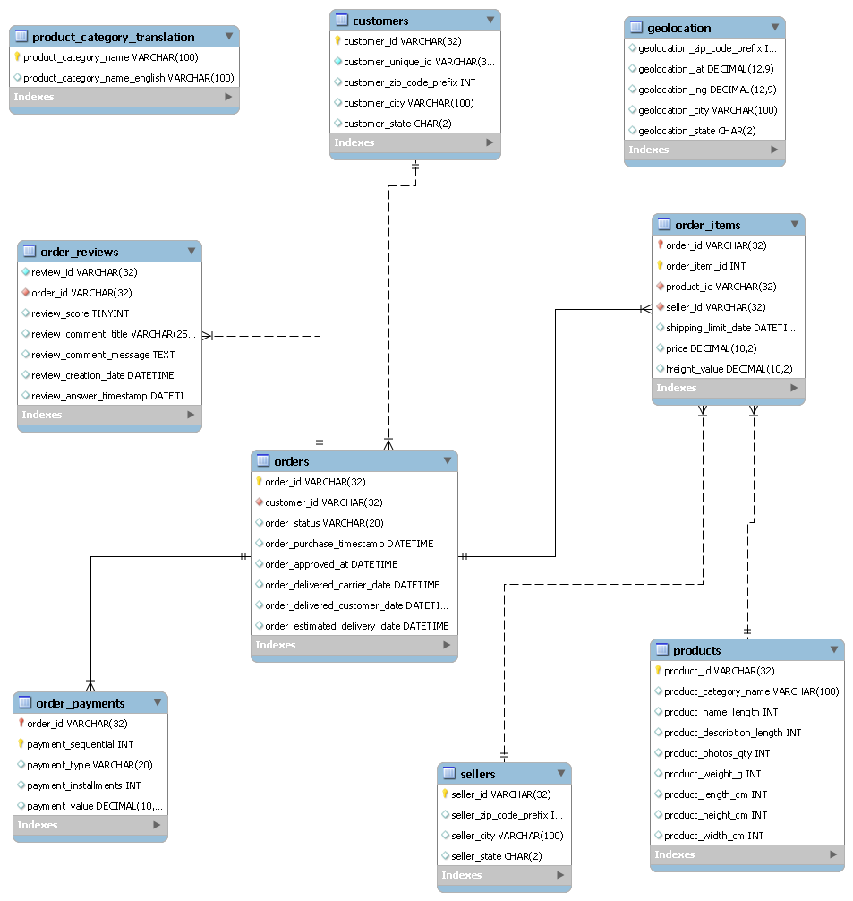

# Olist Customer Retention & Delivery Performance Analytics

<!-- CHANGE: Write 2-3 lines in your own words describing the project and its main result.
Fill this in LAST, once you have real findings. -->

> **Status:** Phase 0 (setup) complete. Phase 1 (SQL and Excel fundamentals) in progress:
> database built and profiled; business-question queries next.

## Business Problem
Olist is a Brazilian e-commerce marketplace where almost all customers buy only once
(confirmed on the data: about 97%, see Key Findings).
This project investigates why customers don't return and what the business can do about it.

**Key questions**
1. Who are the repeat buyers, and how do they differ from one-time buyers?
2. How does delivery performance affect review scores and repeat purchases?
3. Which customer segments and regions offer the biggest retention opportunity?
<!-- CHANGE: edit or add questions as your analysis evolves -->

## Data Source

[Brazilian E-Commerce Public Dataset by Olist](https://www.kaggle.com/datasets/olistbr/brazilian-ecommerce) (Kaggle).

- 99,441 orders from September 2016 to October 2018, across 9 relational CSV files
- The CSVs are not stored in this repo. To reproduce the project, download the dataset
  from Kaggle and extract the files into `data/raw/`
- Raw files are never edited; cleaned outputs go to `data/processed/`

## Database Design



Nine tables in MySQL. Six foreign keys link orders to customers, order items to orders,
products and sellers, and payments and reviews to orders. Before adding the keys, I checked
all six relationships for orphan rows (rows pointing to a parent that does not exist) and
found none. `geolocation` and `product_category_translation` are lookup tables without
foreign keys.

## Key Findings (so far)
All figures come from the profiling queries in `sql/04_data_profiling.sql`.

- **About 97% of customers buy only once.** Of 96,096 real customers, 93,099 (96.9%) placed
  exactly one order. Excluding canceled and unavailable orders, it is 92,102 of 94,990 (96.96%).
- **customer_id is not a person.** It is created per order (99,441 values vs 96,096 real
  customers). All customer counts use `customer_unique_id`.
- **97.0% of orders are delivered** (96,478 of 99,441). 625 are canceled and 609 unavailable.
- **Volume is only reliable from January 2017 to August 2018.** 2016 is nearly empty
  (November 2016 is missing) and September and October 2018 have only 16 and 4 orders.
- **Reviews needed cleaning.** 547 orders have more than one review, and some review IDs are
  shared across orders. Reviews are reduced to one per order (the latest) before any join.

_Delivery impact, cohort retention and segmentation results will be added after Phase 3._

## Dashboard Preview
<!-- CHANGE: Add screenshots after Phase 5, e.g.  -->
_Coming soon._

## Tools & Technologies
<!-- CHANGE: Keep this list accurate. Add or remove anything you actually use. -->
| Purpose | Tool |
|---|---|
| Database | MySQL 8.0 (developed on 8.0.43) |
| SQL client | VS Code "Database Client" extension; MySQL Workbench for the ER diagram |
| Programming | Python 3.x (pandas, NumPy, matplotlib, seaborn, scikit-learn, SciPy, XGBoost, SQLAlchemy, PyMySQL, python-dotenv) |
| Notebooks / editor | VS Code with Jupyter |
| Dashboard | Power BI Desktop |
| Quick analysis | Microsoft Excel |
| Version control | Git, GitHub |
| AI assistants | Claude and ChatGPT, used for guidance, debugging and code review; all code was run and verified by me |

## Setup

**Requirements:** Python 3.10+ (Anaconda), MySQL 8.0+, Git. Built on Windows with PowerShell and VS Code.

1. Clone this repo and open it in VS Code.
2. Download the dataset from Kaggle (see "Data Source") into `data/raw/`.
3. Install the Python libraries listed under Tools & Technologies
   (a `requirements.txt` will be added in Phase 6).
4. Create the database in MySQL:
```sql
   CREATE DATABASE IF NOT EXISTS olist
     CHARACTER SET utf8mb4
     COLLATE utf8mb4_0900_ai_ci;
```
5. Copy `.env.example` to `.env` and fill in your own MySQL details
   (`DB_USER`, `DB_PASSWORD`, `DB_HOST`, `DB_NAME`). `.env` is git-ignored and never committed.
6. Test the connection:
```powershell
   python scripts\test_connection.py
```

## How to Run
<!-- CHANGE: Update as scripts and notebooks are added. -->
1. Complete the Setup section above.
2. Run `sql/01_create_tables.sql`, then load the CSVs: `python scripts\load_data.py`.
3. Run `sql/02_orphan_checks.sql` and `sql/03_add_foreign_keys.sql`.
4. Run `sql/04_data_profiling.sql` (each query has an INSIGHT comment with the result).
5. Further SQL files and the notebooks in `notebooks/` will be added in numbered order.

Note: `load_data.py` is meant for the first load, before the foreign keys exist.

## Project Structure
```
olist-retention-analytics/
├── data/
│   ├── raw/            # original Kaggle CSVs (not tracked)
│   └── processed/      # cleaned data (not tracked)
├── sql/                # commented SQL queries only (numbered 01_, 02_, ...)
├── scripts/            # runnable Python scripts (connection test, data loading)
├── notebooks/          # Python cleaning, EDA, analysis, modeling
├── dashboard/          # Power BI file
├── reports/            # business summary
├── images/             # screenshots and diagrams (ER diagram)
├── PROJECT_CONTEXT.md  # running project notes
├── .env.example        # database settings template (copy to .env)
└── README.md
```

## Approach
<!-- CHANGE: Fill in as you complete each phase. Keep it short and specific. -->
1. **SQL analysis:** database built, verified and profiled; business-question queries in progress
2. **Python cleaning & EDA:** _to be completed_
3. **Cohort, RFM and delivery impact analysis:** _to be completed_
4. **Predictive modeling:** _to be completed_
5. **Power BI dashboard:** _to be completed_

## Recommendations
<!-- CHANGE: Add 3-4 business recommendations with estimated impact, after your analysis. -->
_Coming soon._

## Limitations
<!-- CHANGE: Be honest, e.g. class imbalance, only two years of data, no marketing data. Extend as the project goes on. -->
- Only about two years of data. "Buys once" means once within that window, not for life.
- Customers who first bought late in the period had little time to return, which lowers the measured repeat rate.
- 2016 and the last two months of 2018 are incomplete and are excluded from cohort analysis.
- No marketing or price data.

## About Me
**Karan Patel**

**Data Analyst skilled in Python, SQL, Power BI, and Tableau, focused on data visualization, business insights, ETL, and solving real-world business problems through data.**

LinkedIn: http://www.linkedin.com/in/karan-patel-5a2462271

GitHub: [karanpatel9725-tech](https://github.com/karanpatel9725-tech)